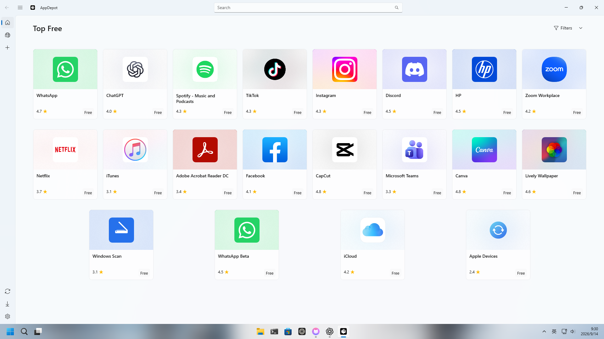
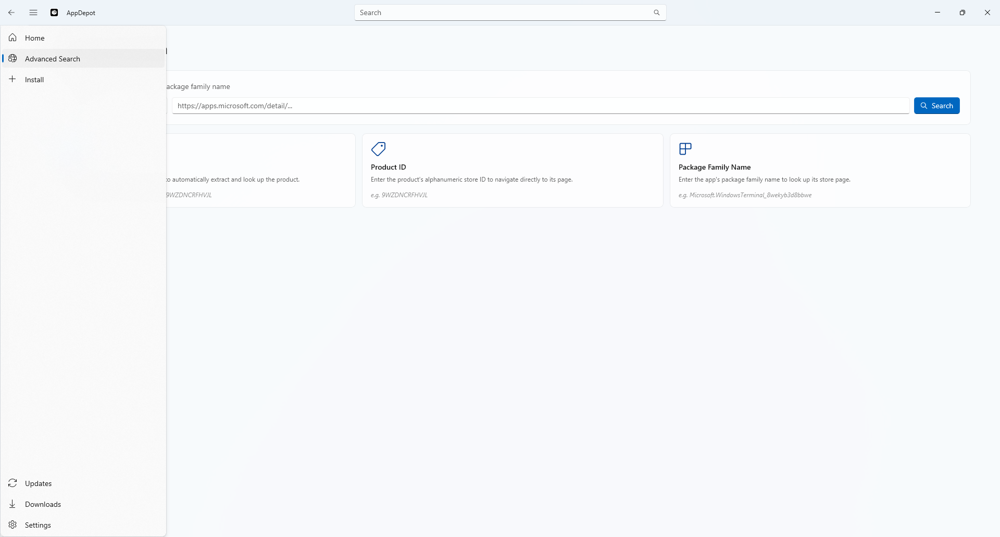
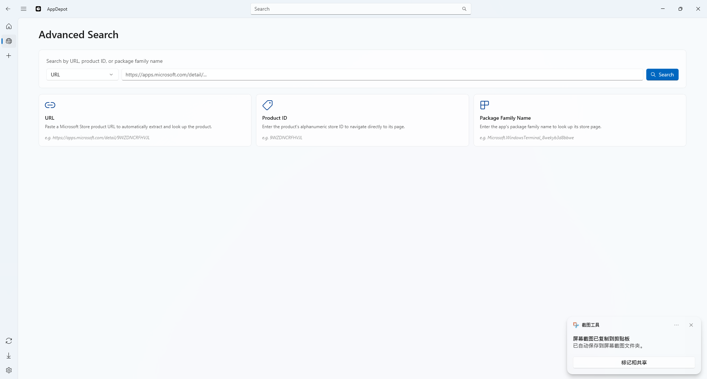
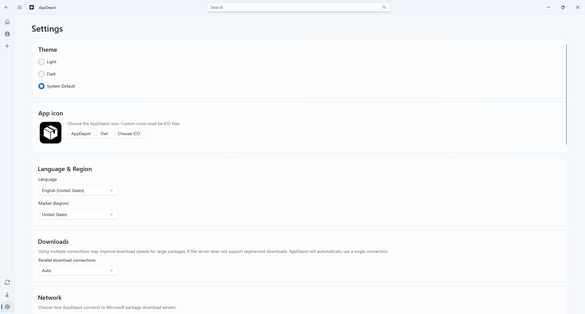

# AppDepot

<p align="center"><b>Windows를 위한 네이티브 오픈 소스 Microsoft Store 클라이언트</b></p>

<p align="center">
  <a href="README.md">English</a> · <a href="README.zh-CN.md">简体中文</a> · <a href="README.zh-TW.md">繁體中文</a> · <a href="README.ja-JP.md">日本語</a> · <a href="README.ko-KR.md">한국어</a> · <a href="README.de-DE.md">Deutsch</a> · <a href="README.es-ES.md">Español</a> · <a href="README.fr-FR.md">Français</a> · <a href="README.pt-BR.md">Português</a> · <a href="README.ru-RU.md">Русский</a> · <a href="README.hu-HU.md">Magyar</a> · <a href="README.ar-SA.md">العربية</a>
</p>

AppDepot은 Microsoft Store 앱을 검색하고, 다운로드하고, 설치하고, 내보내고, 업데이트할 수 있는 Windows 앱입니다. 외부 UWP/MSIX 패키지의 사이드로드와 대역폭을 절약하는 블록 단위 차등 업데이트도 지원합니다.

**WinUI 3**와 **.NET 10**으로 제작되었으며 Windows 10과 Windows 11에 어울리는 Fluent UI를 제공합니다.



## 🖼️ 스크린샷

<p></p>
<p></p>
<p></p>
<p></p>

## ✨ 주요 기능

### 🔍 탐색 및 검색

- **Top Free**와 같은 Microsoft Store 추천 앱 탐색
- 제목 표시줄에서 앱 아이콘과 제목이 포함된 실시간 검색 제안 사용
- **Advanced Search**에서 Store URL, 제품 ID, 패키지 제품군 이름으로 검색
- 설명, 스크린샷, 버전, 종속성이 포함된 앱 상세 페이지 확인
- 설정에서 Store 시장과 언어를 독립적으로 선택

### ⬇️ 다운로드 및 내보내기

- Microsoft CDN에서 Store 패키지 직접 다운로드
- BlockMap 기반 차등 다운로드로 변경된 블록만 가져오기
- `.appx`, `.msix`, `.appxbundle`, `.msixbundle` 패키지를 백업 또는 오프라인 사용을 위해 내보내기
- 진행률, 일시 중지/재개를 지원하는 다운로드 대기열 관리

### 📦 설치 및 사이드로드

- 다운로드한 Store 패키지를 AppDepot에서 직접 설치
- 파일 선택 또는 끌어서 놓기로 로컬 패키지 사이드로드
- 필요한 프레임워크 종속성 자동 검색 및 설치
- 더 최신 버전이 설치되어 있어도 강제 재설치 또는 다운그레이드

### 🔄 업데이트

- 설치된 Store 서명 패키지와 최신 버전 비교
- 차등 업데이트로 다운로드 크기 최소화
- 전체 일괄 업데이트 또는 개별 앱 선택
- 아키텍처와 Windows 빌드를 고려한 버전 비교

### ⚙️ 데스크톱 환경

- 두 가지 배포 방식을 지원합니다: 설치 없이 독립 `.exe`를 바로 실행하는 휴대용 버전과 Store에서 설치 및 업데이트하는 Microsoft Store 버전
- 밝은 테마, 어두운 테마, 시스템 기본 테마 지원
- AppDepot 아이콘, 기본 올빼미 아이콘, 로컬 `.ico` 파일 선택
- 리소스 기반 다국어 UI
- 런타임, 설치, 충돌 로그를 별도로 확인
- GitHub에서 AppDepot 업데이트 확인

## 🌐 지원 언어

영어, 아랍어, 독일어, 스페인어, 프랑스어, 헝가리어, 일본어, 한국어, 브라질 포르투갈어, 러시아어, 중국어 간체, 중국어 번체를 제공합니다.

## 🛑 시스템 요구 사항

- Windows 10 버전 2004, 빌드 19041 이상
- [.NET 10](https://dotnet.microsoft.com/en-us/download/dotnet/10.0) (자체 포함 빌드에서는 불필요)
- [Windows App SDK Runtime](https://learn.microsoft.com/en-us/windows/apps/windows-app-sdk/downloads#windows-app-sdk) (자체 포함 빌드에서는 불필요)

## 🚀 설치 및 실행

[Releases](https://github.com/sdf123098/AppDepot/releases)에서 `x64`, `x86` 또는 `arm64`용 ZIP을 내려받아 압축을 풀고 `AppDepot.exe`를 실행하세요. 휴대용 버전은 `*-self-contained.zip`을 사용합니다.

WinGet을 사용하려면 [WinGet](https://learn.microsoft.com/en-us/windows/package-manager/winget/)을 설치한 뒤 실행하세요.

```powershell
winget install sdf123098.AppDepot
```

오탐지가 발생하면 Releases에서 `raven_cert.zip`을 받아 `raven.cer`를 설치하거나 `install_raven_cert.bat`을 실행하세요.

[AppDepot 동영상 가이드 보기](https://www.youtube.com/watch?v=ZX__BaD6kr0)

### Microsoft Store（권장）

Store에 게시된 후에는 Microsoft Store 페이지에서 설치할 수 있습니다. Store가 MSIX 패키지에 서명하고 배포와 업데이트를 관리합니다. Product ID는 Partner Center 등록이 완료될 때까지 고정하지 않습니다.

### Microsoft Store를 통한 WinGet

Store 목록을 검색할 수 있게 되면 다음 명령으로 같은 Store 패키지를 확인하고 설치할 수 있습니다.

```powershell
winget search <Microsoft Store Product ID> --source msstore
winget install <Microsoft Store Product ID> --source msstore
```

### Windows 릴리스 자동화

`Build and Draft Release` 워크플로는 앱 빌드, 현지화 스모크 테스트, Store용 서명되지 않은 MSIX, 휴대용 ZIP, `SHA256SUMS.txt` 생성을 수행합니다. MSIX는 Store 인증 후 Microsoft가 다시 서명하므로 상용 코드 서명 인증서가 필요하지 않습니다. Store 게시 기능은 기본적으로 꺼져 있으며 Partner Center, GitHub Secrets, 명시적인 게시 확인을 구성한 경우에만 활성화됩니다.

`Publish Microsoft Store Metadata`는 개발자가 검토한 `metadata/metadata.json`만 처리합니다. `Verify WinGet Distribution`은 Store 배포를 먼저 검증하고, 실패하면 검토용 GitHub 휴대용 ZIP 매니페스트를 생성합니다. Pull Request를 자동으로 제출하지 않습니다.

## 🏗️ 프로젝트 구조

AppDepot은 **MVVM** 패턴과 `Microsoft.Extensions.Hosting` 기반 종속성 주입을 사용합니다. 주요 디렉터리는 `Raven/Views`, `Raven/ViewModels`, `Raven/Services`, `Raven/Helpers`, `Raven/Models`, `Raven/Strings`, `Raven.Updater`, `StoreListings` 하위 모듈입니다.

## 🧰 소스에서 빌드

.NET 10 SDK, Visual Studio 2026(.NET Desktop Development 및 Windows App SDK/WinUI 워크로드), Windows 10 SDK (26100)가 필요합니다.

```bash
git clone --recurse-submodules https://github.com/sdf123098/AppDepot.git
cd AppDepot
dotnet build Raven.sln -c Debug -p:Platform=x64
dotnet run --project Raven -c Debug
```

## 🤝 기여하기

저장소를 Fork하고 작업 브랜치를 만든 다음 기존 MVVM/종속성 주입 규칙을 따르세요. XAML의 사용자 표시 문자열은 `x:Uid` 리소스로 현지화하고, 검증 절차를 포함한 Pull Request를 제출해 주세요.

## 📜 라이선스

AppDepot은 **Apache License 2.0**으로 배포됩니다. 자세한 내용은 [LICENSE](LICENSE)를 참조하세요.
